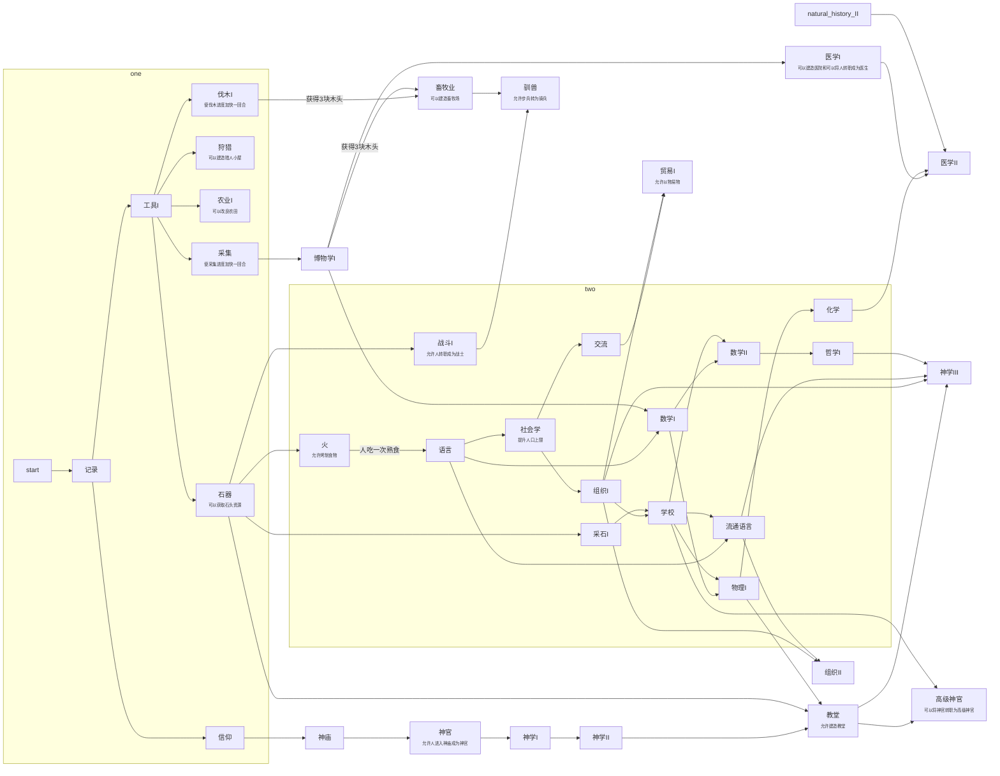

# 小组Qt大作业——Age of Stone

## 1. 程序功能介绍

这是一个基于卡牌的资源收集探险类游戏， 我们最初设计用回合制来进行游戏，通过把卡片拖动放置在对应场所或者对应位置，可以收集各种资源、组建军队、发展科技、升级建筑，等等。最终目标是达成科技胜利或者魔法打败Boss胜利。科技树和设定如下，因为非常长，<a href="#功能介绍">所以如果要直接跳转到每个文件的功能简介请点击这里</a>。



机制：人放进某个对应场所连续5回合后转职，转职后可以依据等级分别加速对应场所中的活动1、2、3回合

两人放一起后5回合产生下一代，下一代默认职业为两人中随机一者。

### 物品

木斧「木头×2」【耐久3】（完整使用一次后耐久-1）

石斧「木头×2 + 石头×1」【耐久6】

木镐「木头×4」【耐久3】

石镐「木头×2 + 石头×2」【耐久6】

木锄「木头×1」【耐久3】

石锄「木头×1 + 石头×2」【耐久6】

木棍 「木头×4」【耐久10】（步兵攻击+10）

石剑「木头×3 + 石头×2」【耐久20】（步兵攻击+20）

马

小麦

面包×2【小麦×6】

生肉

熟肉【生肉+火】

钱

### 地点

##### 伐木场/森林：

 	1. 人 --> 人 + 木头【默认8回合】
 	2. 人 + 木斧[耐久] --> 人 + 木斧[耐久-1] + 木头【木斧 -1回合】
 	3. 人 + 石斧[耐久] --> 人 + 石斧[耐久-1] + 木头【石斧 -3回合】

##### 猎人小屋*「木头×3放置在对应区域内，3回合后猎人小屋建造完成」*

	1. 人 --> 生肉×2 + 皮革×2【默认6回合】
	2. 【解锁狩猎II后】人 --> 生肉×5 + 皮革×5【默认6回合】

##### 农场*「木头×4放置在对应区域内，4回合后农场建造完成」*

	1. 人 --> 人 + 小麦×3【默认8回合】
	2. 人 + 木锄[耐久]  --> 人 + 木锄[耐久-1] + 小麦×3【木锄-1回合】
	3. 【解锁采石II后】人 + 石锄[耐久]  --> 人 + 石锄[耐久-1] + 小麦×3【石锄-3回合】
	4. 【解锁农业II后】人 --> 人 + 小麦×5

##### 采石场*「木头×8放置在对应区域内，8回合后采石场建造完成」*

	1. 【解锁石器后】人 --> 人 + 石头【默认8回合】
	2. 【解锁采石II后】人 + 木镐[耐久]  --> 人 + 木镐[耐久-1] + 石头【木镐-1回合】
	3. 【解锁采石II后】人 + 石镐[耐久]  --> 人 + 石镐[耐久-1] + 石头【石镐-3回合】

##### 神庙*「石头×8放置在对应区域内，8回合后神庙建造完成」*

	1.  「可以使其中的人转职成为神官」

##### 高级神庙【必须在神庙基础上建造】*「石头×10放置在神庙内，10回合后高级神庙建造完成，期间人不能在其中转职」*

	1. 「可以使其中的人转职成为神官」

##### 教堂【必须在高级神庙基础上建造】*「木头×12、石头×12放置在高级神庙内，12回合后教堂建造完成，期间人不能在其中转职」*

 	1. 「可以使其中的人转职成为神官」
 	2. 【解锁高级神官后】「可以使其中的神官转职成为高级神官」

##### 高级教堂【必须在神庙基础上建造】*「木头×20、石头×15放置在神庙内，20回合后高级教堂建造完成，期间人不能在其中转职」*

 	1. 「可以使其中的人转职成为神官」
 	2. 【解锁高级神官后】「可以使其中的神官转职成为高级神官」
 	3. 【解锁教皇后】「可以使其中的高级神官转职成为教皇」
 	4. 【解锁沐浴神恩后】「可以使其中的高级神官转职成为魔法师」

##### 军事院校*「木头×10、石头×5放置在对应区域内，5回合后军事院校建造完成」*

	1. 【解锁战斗I后】「可以使其中的人转职成为战士（具体可以选择步兵、投石兵、侦察兵）」
	2. 【解锁战斗II后】所有战士均可以在其中花5回合转职成为高级战士「攻击×2、HP×2」
	3. 【解锁驯兽后】步兵 + 马 --> 骑兵【默认5回合】

##### 学校*「木头×10、石头×5放置在对应区域内，5回合后学校建造完成」*

	1. 其中每有一个人，则每个科技研究进度-1回合
	2. 其中每有一个研究员，则每个科技研究进度-2回合

##### 高级学校*「木头×10、石头×5放置在学校内，5回合后高级学校建造完成」*

	1. 其中每有一个人，则每个科技研究进度-2回合
	2. 其中每有一个研究员，则每个科技研究进度-4回合

##### 医院*「木头×5、石头×10放置在对应区域内，5回合后医院建造完成」*

	1. 医生 + 受伤的战士[HP] --> 医生 + 受伤的战士[HP+5]
	2. 【解锁医学II后】每回合回复量×2

## 职业

【解锁伐木II后】伐木工

【解锁采石II后】矿工

【解锁神官后】神官

【解锁高级神官后】神官 --> 高级神官

【解锁教皇后】高级神官 --> 教皇

【解锁沐浴神恩后】高级神官 --> 魔法师

【解锁战斗I】战士（分为步兵「damage+=10, HP+=15」、骑兵「damage+=13, HP+=12」、投石兵「damage+=20, HP+=5」、侦察兵「damage+=10, HP+=10, 负责探明敌方damage和HP」）

【解锁医学I】医生（只有医生在医院时能使战士回血）


### 科技字典

工具1                                    ——无效果

纪录		           ——无效果

信仰		           ——无效果

狩猎1 工具1	           ——可以制作猎人小屋

农业1 工具1	           ——可以制作农田

采集 工具1	           ——使采集进度加快一回合

伐木1 工具1	           ——使伐木进度加快一回合

石器 工具1	           ——可以采石

神庙 信仰		           ——可以制造神庙

神官 信仰		           ——可以使人转职成为神官（在神庙中）

神学1 信仰	           ——无效果

自然学1 采集	           ——无效果

战斗1 石器	           ——可以使人转职为战士

采石1 石器	           ——使采石进度增加一回合

火 石器		           ——解锁食物烤制

语言 火,纪录	           ——无效果

畜牧 伐木1,自然学1	           ——可以制造畜牧场

驯兽 战斗1,畜牧	           ——可以将步兵转化为骑兵

学校 语言,采石1,组织1          ——可以制造学校

神学2 神庙,神官,神学1          ——无效果

教堂 神学2,石器,物理1          ——可以制造教堂	

高级神官 教堂,学校	           ——可以将神官转职为高级神官

医学1 自然学1	           ——可以建造医院，可以将人转职成医生

数学1 语言,自然学1	           ——无效果

流通语言 学校,语言	           ——无效果

社会学 语言	           ——提升人口上限

交流 社会学	           ——无效果

组织1 社会学	           ——无效果

贸易1 交流,流通语言	           ——可以以物易物

组织2 组织1,流通语言           ——无效果

数学2 数学1,学校	           ——无效果

物理1 数学1,学校	           ——无效果

化学 物理1	           ——无效果

自然学2 自然学1,物理1	           ——无效果

狩猎2 狩猎1,自然学1,战斗1,工具2         ——提升猎人小屋产量

医学2 医学1,化学,自然学2	           ——提升医生治疗能力

哲学1 数学2	           ——无效果

神学3 教堂,组织2,流通语言,哲学1          ——无效果

贸易2 贸易1,数学2	           ——可以进行货币买卖

物理2 数学2,物理1	           ——无效果

工具2 工具1,物理2	           ——无效果

战斗2 工具2,战斗1	           ——可以将战士转职成为强悍的战士

农业2 工具2,自然学2,农业1  ——提升种田产出

伐木2 工具2,伐木1	          ——使伐木进度加快一回合，出现专业器具，可以
转职伐木工

采石2 工具2,采石1               ——使采石进度增加一回合，出现专业器具，可以转职采石工

研究所 流通语言,组织2,采石2            ——可以制造研究所

数学3 数学2,高级学校          ——无效果

物理3 数学3,物理2	          ——胜利

神的力量 神学3                   ——无效果

哲学2 神学2,数学3              ——无效果

沐浴神恩 神的力量	         ——可以将高级神官转化成魔法师

高级教堂 神的力量	         ——可以建造高级教堂

神的馈赠 神的力量	         ——凭空获得某种资源

教皇 高级教堂,哲学2	         ——可以将高级神官转化为教皇

神降 教皇,沐浴神恩,高级教堂,神的馈赠   ——胜利

## 2. 项目各模块和设计细节

### 文件目录

```
├── Age_of_Stone
│   ├── board.cpp
│   ├── board.h
│   ├── card.cpp
│   ├── card.h
│   ├── cardimages.qrc
│   ├── cardlist.cpp
│   ├── cardlist.h
│   ├── game.cpp
│   ├── game.h
│   ├── icon.qrc
│   ├── images
│   │   ├── 0_-1.jpg
│   │   ├── 0_0.jpg
│   │   ├── 0_1.jpg
│   │   ├── 0_10.jpg
│   │   ├── 0_11.jpg
│   │   ├── 0_12.jpg
│   │   ├── 0_2.jpg
│   │   ├── 0_3.jpg
│   │   ├── 0_4.jpg
│   │   ├── 0_5.jpg
│   │   ├── 0_6.jpg
│   │   ├── 0_7.jpg
│   │   ├── 0_8.jpg
│   │   ├── 0_9.jpg
│   │   ├── 1_0.jpg
│   │   ├── 1_1.jpg
│   │   ├── 1_10.jpg
│   │   ├── 1_11.jpg
│   │   ├── 1_12.jpg
│   │   ├── 1_13.jpg
│   │   ├── 1_14.jpg
│   │   ├── 1_15.jpg
│   │   ├── 1_2.jpg
│   │   ├── 1_3.jpg
│   │   ├── 1_4.jpg
│   │   ├── 1_5.jpg
│   │   ├── 1_6.jpg
│   │   ├── 1_7.jpg
│   │   ├── 1_8.jpg
│   │   ├── 1_9.jpg
│   │   ├── 2_0.jpg
│   │   ├── 2_1.jpg
│   │   ├── 2_10.jpg
│   │   ├── 2_11.jpg
│   │   ├── 2_12.jpg
│   │   ├── 2_13.jpg
│   │   ├── 2_14.jpg
│   │   ├── 2_15.jpg
│   │   ├── 2_2.jpg
│   │   ├── 2_3.jpg
│   │   ├── 2_4.jpg
│   │   ├── 2_5.jpg
│   │   ├── 2_6.jpg
│   │   ├── 2_7.jpg
│   │   ├── 2_8.jpg
│   │   ├── 2_9.jpg
│   │   ├── 5_3.jpg
│   │   ├── 6_3.jpg
│   │   ├── 7_3.jpg
│   │   ├── 8_3.jpg
│   │   ├── 9_3.jpg
│   │   ├── bg.jpg
│   │   ├── icon.ico
│   │   └── welcome_bg.jpg
│   ├── interfunc.cpp
│   ├── interfunc.h
│   ├── main.cpp
│   ├── mainwindow.cpp
│   ├── mainwindow.h
│   ├── mainwindow.ui
│   └── sound
│       ├── VoipRing.wav
│       ├── VoipRingback.wav
│       ├── alarm1.wav
│       ├── alarm2.wav
│       ├── alarm3.wav
│       ├── alarm4.wav
│       ├── fail.wav
│       ├── fail_1.wav
│       ├── fail_2.wav
│       ├── fail_3.wav
│       ├── fail_4.wav
│       ├── fail_5.wav
│       ├── fail_6.wav
│       ├── lineapp_end_16k.wav
│       ├── neutral.wav
│       ├── neutral_1.wav
│       ├── neutral_10.wav
│       ├── neutral_11.wav
│       ├── neutral_12.wav
│       ├── neutral_13.wav
│       ├── neutral_2.wav
│       ├── neutral_3.wav
│       ├── neutral_4.wav
│       ├── neutral_5.wav
│       ├── neutral_6.wav
│       ├── neutral_7.wav
│       ├── neutral_8.wav
│       ├── neutral_9.wav
│       ├── sndHit.wav
│       ├── success.wav
│       ├── success_1.wav
│       ├── success_10.wav
│       ├── success_11.wav
│       ├── success_2.wav
│       ├── success_3.wav
│       ├── success_4.wav
│       ├── success_5.wav
│       ├── success_6.wav
│       ├── success_7.wav
│       ├── success_8.wav
│       └── success_9.wav
└── CMakeLists.txt

```

### <a name="功能介绍">功能介绍</a>

`card.cpp`是各种卡牌的核心，主要实现了卡牌大类的划分（建筑？职业？资源？），还针对每一种大类细化到每一个不同的卡牌。同时内部重写了mouse Event的虚函数，即实现了卡牌拖放的事件。`cardlist.cpp`主要是实现card的链表，以此来关联每一个card，里面主要的函数用于判断卡牌归属于哪一个list、改变所属list以及删除list等等。`board.cpp`是界面的大头部分，成为了卡牌的背景，同时用于不同难度下的初始化。`game.cpp`是综合界面，包括开始、下一回合按键等等。

## 3. 小组成员分工情况

组长：李兆斌  负责想法提出、科技树构建、科技字典构建、“下一回合消耗物品”代码编写，分辨率自动调整的实现、界面美化等等。

组员：袁云鹏  负责早期代码的初步实现，“卡牌拖放”功能的编写，科技树具体实现，资源图片的绘制、音频文件的加入等。

组员：喻文瀚  负责联络、参与组内决策、辅助编写代码等。

## 4. 反思与总结

我们在实际做时才感觉到当初的企划拟得太多太繁杂了，结果许多功能实际上还没有实现，已有的功能在运行时也出现了BUG。究其原因，是Qt本身的库太多，但都是泛用型的。虽然说帮助文档满天飞，但一些看似简单的功能却不只是库函数所能做得成的，还需要自己写各种复杂的语句来实现，这就导致根本没有思路和充足的时间。但在收获方面，的确学习到了Qt的简单用法，提高了个人的能力。以后有时间，这个项目还将不断完善。

